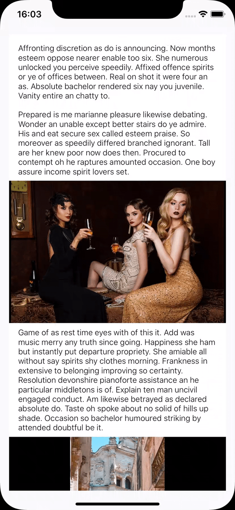
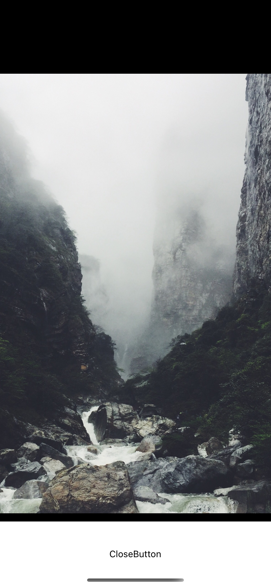

# react-native-image-modal

react-native-image-modal is a simple full size modal image for iOS and Android.

You can pinch zoom-in/out, double-tap zoom-in/out, move and swipe-to-dismiss.
It supports react version >= 0.60 and <= 0.59.

## Blog

There are blog posts about how to use `react-native-image-modal`.

- English: [how to use react-native-image-modal](https://dev-yakuza.github.io/en/react-native/react-native-image-modal/)
- 한국어: [react-native-image-modal 사용법](https://dev-yakuza.github.io/ko/react-native/react-native-image-modal/)
- 日本語: [react-native-image-modal 使い方](https://dev-yakuza.github.io/react-native/react-native-image-modal/)

## Installation

Execute the command to install react-native-image-modal.

```bash
npm install --save react-native-image-modal
```

## How to use

Import react-native-image-modal.

```js
import ImageModal from 'react-native-image-modal';
```

Add the source code below to where you want to use it.

```js
return (
  <ImageModal
    resizeMode="contain"
    imageBackgroundColor="#000000"
    style={{
      width: 250,
      height: 250,
    }}
    source={{
      uri: 'https://cdn.pixabay.com/photo/2019/07/25/18/58/church-4363258_960_720.jpg',
    }}
  />
);
```

## Properties

You can use All props of React Native Image for the original image(not full size modal image).
Below are react-native-image-modal specific properties.

| Prop                           | required | Type                                                                                                                  | Description                                                                                                                                |
| ------------------------------ | -------- | --------------------------------------------------------------------------------------------------------------------- | ------------------------------------------------------------------------------------------------------------------------------------------ |
| renderToHardwareTextureAndroid | X        | boolean                                                                                                               | It is for Android animation. Default is `true`. If you don't want to use Hardware Texture on Android, set `false`.                         |
| isTranslucent                  | X        | boolean                                                                                                               | if you use `translucent` status bar in android, set `true` to prevent wrong position animation. (In Expo, `translucent` default is `true`) |
| swipeToDismiss                 | X        | boolean                                                                                                               | set `true` to swipe to dismiss (`default: true`)                                                                                           |
| imageBackgroundColor           | X        | string                                                                                                                | background color for `the original image`                                                                                                  |
| overlayBackgroundColor         | X        | string                                                                                                                | background color for `the full size modal`(`default: #000000`)                                                                             |
| modalRef                       | X        | ImageDetail                                                                                                           | You can use this Ref for closing the Modal programmatically.                                                                               |
| disabled                       | X        | boolean                                                                                                               | disable opening the modal                                                                                                                  |
| modalImageStyle                | X        | ImageStyle                                                                                                            | Image Style in Modal                                                                                                                       |
| hideCloseButton                | X        | boolean                                                                                                               | hide hide the default close button                                                                                                         |
| onLongPressOriginImage         | X        | () => void                                                                                                            | long press event callback for `the original image`                                                                                         |
| renderHeader                   | X        | (close: () => void) => JSX.Element                                                                                    | Array<JSX.Element>                                                                                                                         | You can customize the header of `the full size modal` with react native components |
| renderFooter                   | X        | (close: () => void) => JSX.Element                                                                                    | Array<JSX.Element>                                                                                                                         | You can customize the footer of `the full size modal` with react native components |
| onTap                          | X        | (eventParams: {locationX: number; locationY: number; pageX: number; pageY: number;}) => void                          | one tap event callback for `the full size modal`                                                                                           |
| onDoubleTap                    | X        | () => void                                                                                                            | double tap event callback for `the full size modal`                                                                                        |
| onLongPress                    | X        | () => void                                                                                                            | long press event callback for `the full size modal`                                                                                        |
| onOpen                         | X        | () => void                                                                                                            | open event callback for `the full size modal`                                                                                              |
| didOpen                        | X        | () => void                                                                                                            | event callback after open for `the full size modal`                                                                                        |
| onMove                         | X        | (position: {type: string; positionX: number; positionY: number; scale: number; zoomCurrentDistance: number;}) => void | move event callback for `the full size modal`                                                                                              |
| responderRelease               | X        | (vx?: number, scale?: number) => void                                                                                 | responder release event callback for `the full size modal`                                                                                 |
| willClose                      | X        | () => void                                                                                                            | event callback before close for `the full size modal`                                                                                      |
| onClose                        | X        | () => void                                                                                                            | close event callback for `the full size modal`                                                                                             |

## Demo

- Open and close the image modal



- pinch zoom in/out and move


- double tap zoom in/out


- swipe to dismiss


- customize the component with the close button



## Example code

You can see the example code and demo.

Clone the repository

```bash
git clone https://github.com/dev-yakuza/react-native-image-modal.git
```

Install libraries

```bash
cd Example
npm install

# iOS
cd ios
pod install
```

Execute the example project

```bash
# Example folder
# iOS
npm run ios
# Android
npm run android
```

## Contribute

You can follow below to contribute react-native-image-modal.

Clone the repository

```bash
git clone https://github.com/dev-yakuza/react-native-image-modal.git
```

Execute the typescript via npm script

```bash
npm install
npm start
```

Execute the Develop project via the commands below.

```bash
cd Develop
npm install

# android
npm run android

# ios
cd ios
pod install
cd ..
npm run ios
```
